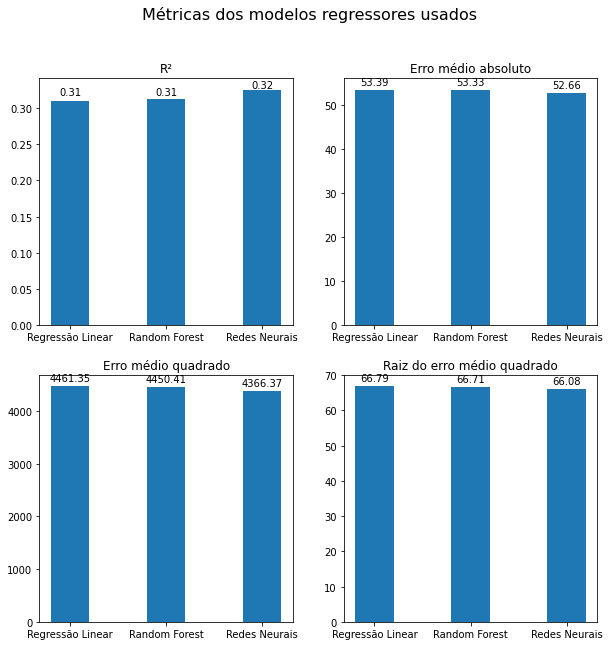
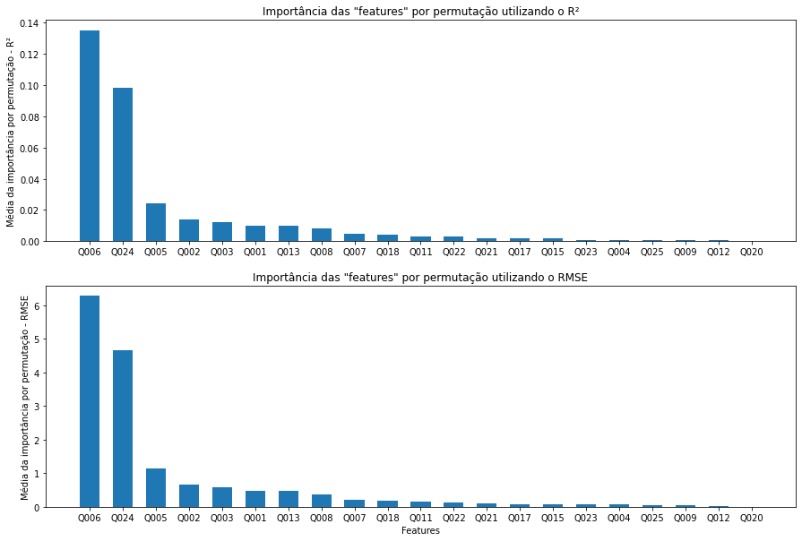
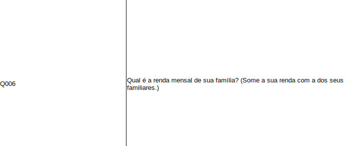
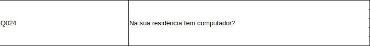
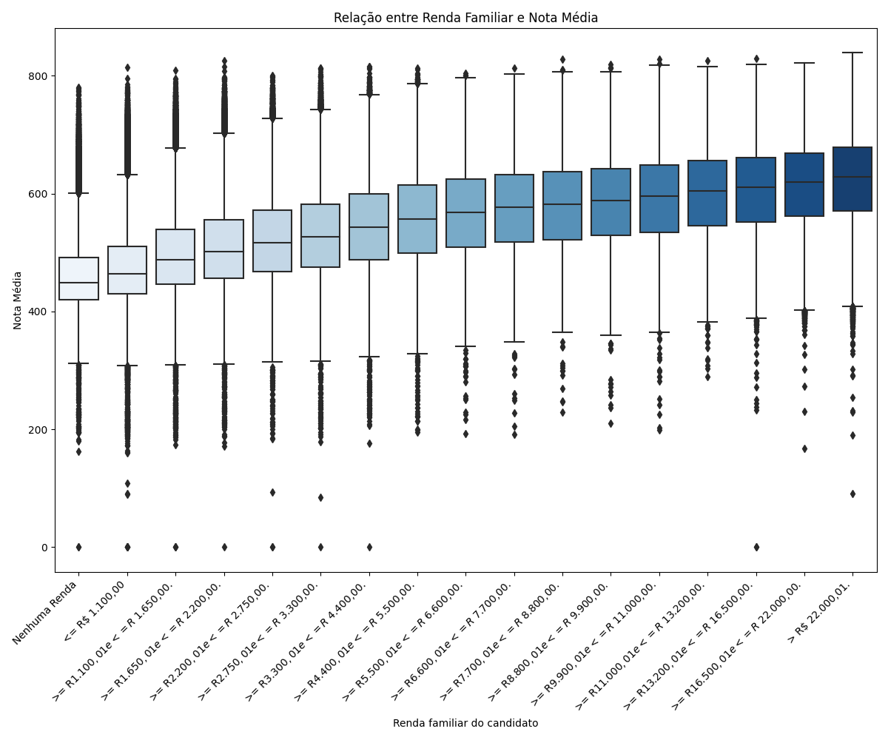
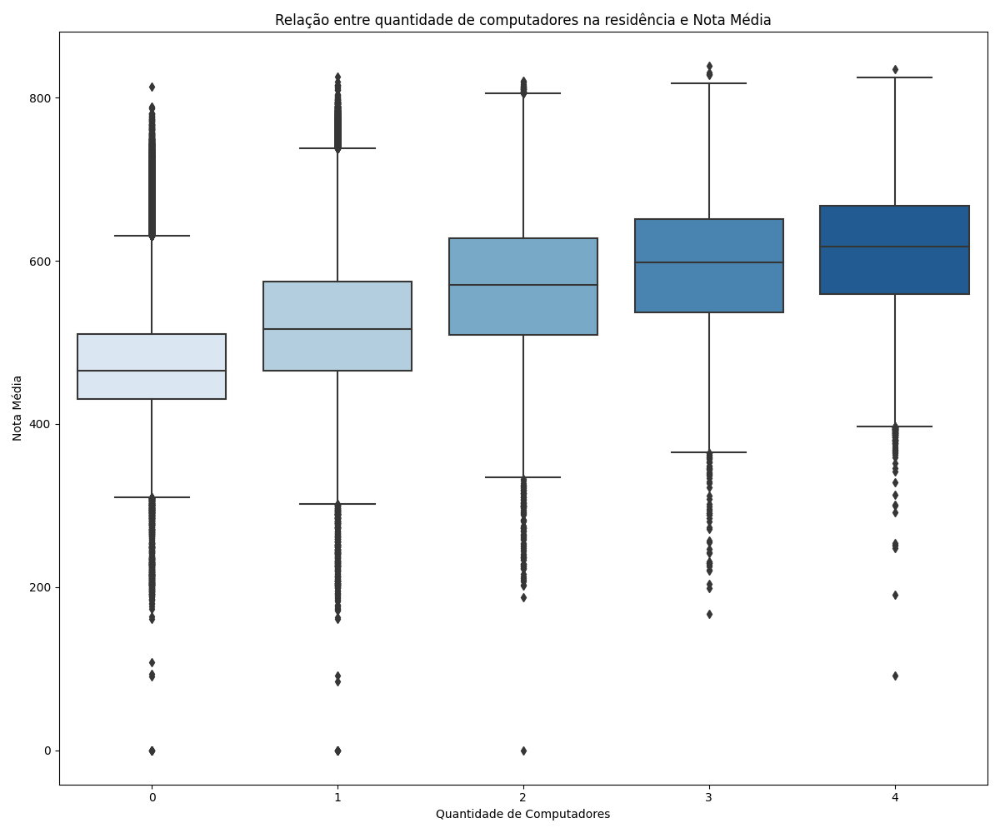
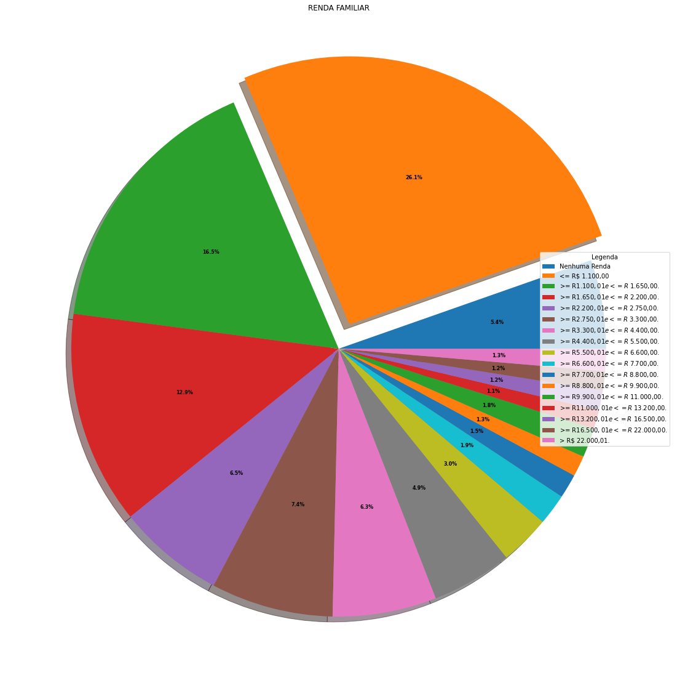
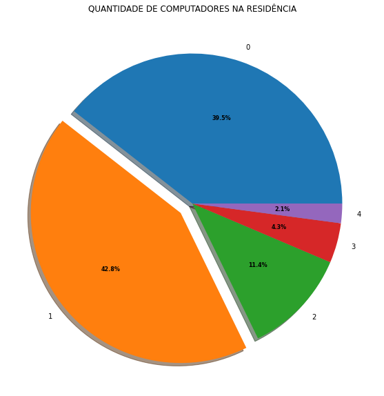

#### <em> Este é apenas um resumo do relatório, o conteúdo completo se encontra no arquivo main.pynb </em> 

# Desenvolvimento e aplicação de modelos de aprendizagem de máquina para estimar nível de influência das questões socioeconômicas no desempenho dos candidatos do ENEM 2021.

## RESUMO

A análise preditiva é uma técnica avançada que usa dados, algoritmos e Aprendizado de Máquina para prever tendências e fazer previsões em negócios. Este relatório usa dados do ENEM de 2021 para analisar as informações socioeconômicas dos participantes e estimar a importância das questões socioeconômicas no desempenho dos candidados. Foram utilizados 3 algoritmos de Aprendizado de Máquina para criar modelos preditivos, sendo eles "Regressão Linear", "Random Forest" e Redeus Neurais. Foi constatado que o modelo de Rede Neural teve o melhor desempenho nas métricas utilizadas, apresentando melhor valor de R² e Erro Médio Quadrado. Algumas características socioeconômicas se destacaram nos 3 modelos aplicados. A renda total da família é a questão que mais influenciou o desempenho dos candidatos, seguido pela presença ou não de computador com acesso a internet da residência e a quantidade de pessoas que moram na residência do candidato.

## INTRODUÇÃO

De acordo com o Ministério da Educação, o ENEM visa avaliar o desempenho dos estudantes no fim da escola básica. No entanto, o ENEM também pode ser usado como uma fonte valiosa de informações para entender como fatores socioeconômicos afetam a qualidade do aprendizado dos estudantes do Ensino Médio. Isso é possível porque o exame atrai muitos estudantes de diferentes grupos sociais e econômicos. Na última edição, em 2019, mais de 3 milhões de pessoas se inscreveram no ENEM (INEP, 2021), fornecendo uma amostra representativa dos estudantes que desejam ingressar no ensino superior. Além disso, todos os candidatos são obrigados a responder a um questionário com uma série de perguntas no momento da inscrição. Isso resulta em 136 informações diferentes para cada candidato, incluindo informações básicas como idade, sexo e município de residência, bem como detalhes como escolaridade dos pais, número de banheiros em casa e acesso à internet.
 
O ENEM foi criado originalmente para avaliar o desempenho dos estudantes no final da educação básica. Depois da reformulação em 2009, o exame passou a ser realizado não apenas como uma forma de avaliação, mas também por estudantes que desejam uma vaga em programas de Educação Superior, como o Sistema de Seleção Unificada (SISU), o Programa Universidade para Todos (ProUni) e o Fundo de Financiamento ao Estudante do Ensino Superior (Fies). Vários trabalhos foram produzidos sobre o ENEM ao longo de sua história, e o INEP tem produzido diversos documentos e bases de dados que mostram os resultados e análises do exame. Apesar disso, a maioria dos trabalhos sobre o ENEM se concentra em classificar alunos e instituições, em vez de criar mecanismos ou descobrir insights que possam ajudar os professores em sua prática diária. Este relatório busca descobrir insights que possam ser usados para melhorar a qualidade da educação nacional, usando os microdados do ENEM 2021 e aplicando técnicas de Aprendizado de Máquina para prever resultados e capturar características relevantes dos participantes.

## OBJETIVOS

O objetivo deste relatório é construir, modelar e executar modelos preditivos com base em um conjunto de dados de amostra simples de participantes do ENEM 2018 residentes em todo o Brasil. O desempenho dos modelos preditivos será avaliado usando métricas de regressão. O método de importância de permutações será usado para inspecionar os modelos e identificar as características mais importantes para os modelos.

## MATERIAIS E MÉTODOS

Os dados do ENEM estão disponíveis no site do INEP e podem ser baixados gratuitamente. Eles incluem provas, gabaritos, informações sobre itens, notas e questionários preenchidos pelos inscritos. Os dados vêm em uma pasta compactada que precisa ser descompactada para poder ser usada. A pasta contém cinco pastas, cada uma com informações diferentes. A pasta de dados contém dois arquivos do Excel com informações sobre as provas e os questionários preenchidos pelos participantes. A pasta de dicionário de dados contém informações sobre as variáveis presentes nos dados, o que é importante para entender a estrutura dos dados e como usá-los.

#### <li> Pré-processamento e limpeza dos dados

Foi feito um pré-processamento dos dados ('first_clean.pynb'), tirando colunas desnecessárias para o objetivo deste relatório afim de diminuir o tamanho do arquivo original e o tempo de processamento.
Na limpeza foi notado uma grande quantidade de dados 'ausentes' nas variáveis alvo (Notas das provas). Isso ocorre pela abstenção do candidato na referida prova. A abordagem para este problema foi a elimanação das linhas que continham dados ausentes.

#### <li> Candidados "treineiros"

Foram selecionados somente os candidados 'não-treineiros' para o treinamento dos modelos. 

#### <li> Agregando variáveis alvo

Para simplificar o treinamento dos modelos foi criada uma nova varíavel alvo com a média de todas as notas das provas dos candidados (ciências da natureza, ciências humanas, matemática e linguagens).

#### <li> Tratamento variáveis categórias

Todas as variáveis categóricas foram transformadas para númericas para assim treinamento adequado do modelo.

#### <li> Métricas usadas para avaliação

As métricas usadas foram o coeficiente de correlação (R²), erro médio absoluto(MAE), erro médio quadrado(MSE) e a raiz quadrada do erro-médio(RMSE).

## RESULTADOS E DISCUSSÕES

Após a aplicação dos modelos, foram obtidos as seguintes métricas:

Observou-se um R² melhor para o modelo de redes neurais. Seguido da 'Random Forest' e o modelo de regressão linear.
Para as métricas de erro (MAE, MSE, RMSE) a tendência também foi vista, com melhores resultados (menores erros) para Redes Neurais.

Sendo assim, para a análise das features foi escolhido o método de Redes Neurais.
Através do modelo preditivo podemos assim estimar as importância de cada uma das 'features' para a variável alvo. Foram utilizados o R² e o RMSE para a construção da permutação randômica.

Observa-se que as questões Q006 e Q024 se destacam entre as 'features'. As duas somadas correspondem a aproximadamente 70% do total da importância do modelo como todo.

Podemos afirmar que, para este modelo e ano dos dados do ENEM utilizados, a renda familiar e a existência de computador na residência são os fatores socioeconômicos que mais influenciam o desempenho dos candidados.

*quanto maior o valor número da variável independente maior a renda familiar

Ao analisar os gráficos relacionando a variável alvo (média das provas) com cada uma destas questões, conseguimos tirar algumas conclusões:

<li>Há uma tendência positiva para a renda familiar. O gráfico sugere que quanto maior a renda melhor o desempenho do candidato.</li>
<li>A tendência para a questão seguinte também permanece, sendo os candidatos com melhor desempenho os que tem 1 ou mais computadores na residência.</li> 

Para estes dados temos aproximadamente 36% dos candidatos têm renda menor que 2 salários mínimos, ~40% dos candidatos não possuem computador em casa e 42% possuem 1 computador.

## CONCLUSÃO

A partir da construção dos modelos conseguimos destacar as questões socioeconômicas que mais afetaram o desempenho dos candidados do ENEM no ano de 2021. A renda familiar e possuir computador na residência foram as questões que mais se destacaram no modelo (~70%). Este resultado se aproxima com as referências utilizadas e trabalhos realizados com dados de outros anos do modelo.
Para futuros trabalhos, seria interessante o aprimoramento do modelo buscando parâmetros otimizados, exclusão de features que interferem pouco para o modelo e aprimoramento da arquitetura geral do modelo de Redes Neurais.
Para o objetivo deste relatório, o modelo utilizado foi adequado.

## REFERÊNCIAS

<li> CASSIANI, S.; SILVA, H. D.; PIERSON, A. OLHARES PARA O ENEM NA EDUCAÇÃO
CIENTÍFICA E TECNOLÓGICA. JUNQUEIRA & MARIN, 2016. ISBN 9788582030257.
Disponível em: <https://books.google.com.br/books?id=q7R2DwAAQBAJ>.
 
<li> FARIAS, E. R.; MARCIO. USO DE DATA SCIENCE NA ANÁLISE DAS PROVAS DO ENEM.
Disponível em: <[https://books.google.com.br/books?id=q7R2DwAAQBAJ](https://dspace.bc.uepb.edu.br/xmlui/bitstream/handle/123456789/26068/PDF%20-%20Marcio%20Edglaiton%20Rosa%20Farias?sequence=1&isAllowed=y)>.
 
<li> ROSAL, I. L. Iury Rosal. Disponível em: <https://github.com/iuryrosal/machine-learning>. Acesso em: 11 dez. 2022.

<li> gustavomccoelho. Prevendo Desempenho no ENEM através de Fatores Socioeconômicos e Métodos de Aprendizado de Máquina. Disponível em: <https://github.com/gustavomccoelho/Previsao-de-Desempenho-ENEM>. Acesso em: 11 dez. 2022.